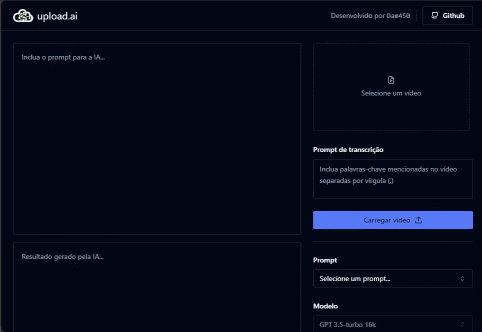

<p align="center">
  <a href="#">
    
  </a>
</p>

<h1 align="center"> upload.ai</h1>

<p align="center">
  <a href="#licença">
    
  </a>
</p>

Aplicação para upload e transcrição de vídeos para, com uso da API de inteligência artificial da OpenAI, gerar títulos e descrições do vídeo para auxílio a produtores de conteúdo.

## Demonstração

<p align="center">
  <a href="#demonstração">
    
  </a>
</p>

## Deploy

Para fazer o deploy desse projeto, faça um clone do repositório

```bash
git clone git@github.com:dam450/upload-ai.git
```

acesse a pasta `server` do projeto e instale as dependencias do backend

```bash
pnpm install
```

Crie o arquivo `.env` informando as [variáveis de ambiente](#vari%C3%A1veis-de-ambiente) conforme modelo

execute a migration para criação do banco de dados

```bash
pnpm run prisma:migrate
```

e execute o backend da aplicação

```bash
pnpm run dev
```

agora acesse a pasta `web` e instale as dependencias do frontend

```bash
pnpm install
```

e depois execute o frontend

```bash
pnpm run dev
```

## Variáveis de Ambiente

Para rodar esse projeto, você vai precisar adicionar as seguintes variáveis de ambiente no arquivo `.env` da pasta `server`.

`OPENAI_API_KEY` : forneça uma chave para api da openAI

`DATABASE_URL` : local onde será salvo o banco de dados

## Stack utilizada

**Front-end:** React, TailwindCSS, Shadcn/ui, Axios, Wasm, ffmpeg

**Back-end:** Node, Fastify, Prisma, SQLite, Zod, OpenAi


## Licença

Projeto sob a licença [MIT](./license.md).

---

> Projeto desenvolvido durante a NLW AI da Rocketseat

